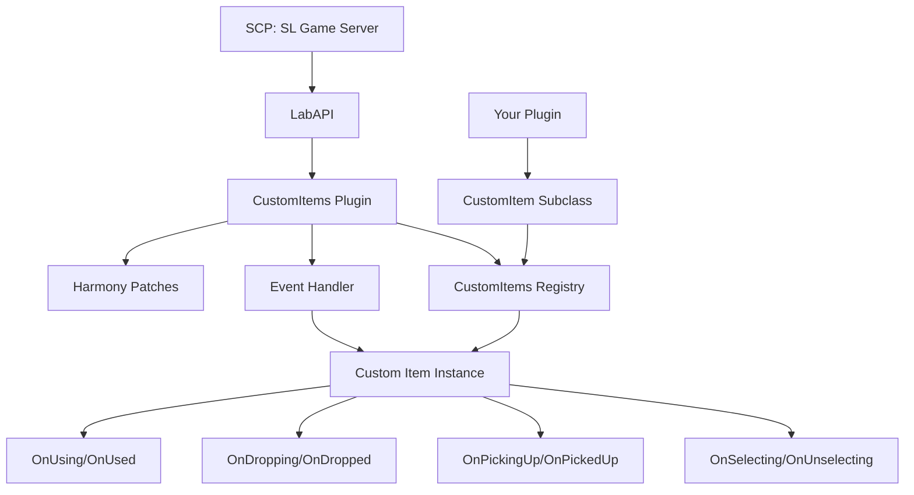

## Overview

CustomItems LabAPI is a plugin framework built on top of LabAPI that enables developers to create custom items for SCP: Secret Laboratory. The framework provides a robust architecture for registering, managing, and handling events for custom items throughout their lifecycle.

## Core components

The framework consists of several key components that work together:

### Plugin system

The framework is implemented as a LabAPI plugin with the following characteristics:

- **Load priority**: `Highest` - Ensures custom items are available before other plugins
- **Harmony patching**: Uses Harmony library for runtime code modification
- **Event management**: Integrates with LabAPI's `CustomHandlersManager`

```csharp CustomItemsPlugin.cs:41-58
public override void Enable()
{
    Instance = this;

    if (_hasIncorrectSettings)
        Log.Error("CustomItems: Incorrect settings in config.yml. Please check the file.");

    harmony = new Harmony("bill.customitems-" + DateTimeOffset.UtcNow.ToUnixTimeMilliseconds());

    harmony.PatchAll();
    foreach (var a in harmony.GetPatchedMethods())
        Log.Debug("Patched: " + a.Name);

    CustomHandlersManager.RegisterEventsHandler(Events);

    if (Config.EnableExampleItems) API.CustomItems.RegisterAll();

    Log.Info("CustomItems plugin loaded successfully.");
}
```

### Registration system

Custom items are managed through a centralized registration system (`CustomItems.API.CustomItems`) that:

- Assigns unique IDs to each registered item
- Maintains dictionaries for fast lookup by ID or name
- Tracks active item instances by their serial numbers
- Provides spawn and give functionality

See the [registration page](/concepts/registration) for detailed information.

### Event handler bridge

The `EventHandler` class bridges LabAPI events to custom item event hooks:

```csharp EventHandler.cs:34-43
public override void OnPlayerUsingItem(PlayerUsingItemEventArgs ev)
{
    if (!Check(ev.UsableItem.Serial)) return;
    API.CustomItems.CurrentItems[ev.UsableItem.Serial].OnUsing(ev);
}
public override void OnPlayerUsedItem(PlayerUsedItemEventArgs ev)
{
    if (!Check(ev.UsableItem.Serial)) return;
    API.CustomItems.CurrentItems[ev.UsableItem.Serial].OnUsed(ev);
}
```

The event handler:
1. Intercepts LabAPI player events
2. Checks if the item involved is a custom item (by serial number)
3. Delegates to the appropriate custom item instance's event hook

## Architecture diagram



## Integration with game loop

### Startup sequence

1. **Plugin initialization**: `CustomItemsPlugin.Enable()` is called
2. **Harmony patching**: Runtime patches are applied to game code
3. **Event registration**: Event handler is registered with LabAPI
4. **Item registration**: Your custom items are registered (manually or via `RegisterAll()`)
5. **Ready**: Custom items are now active and responding to events

### Runtime flow

When a player interacts with a custom item:

1. **Game event occurs**: Player uses, drops, picks up, or selects an item
2. **LabAPI intercepts**: Event is captured by LabAPI's event system
3. **EventHandler receives**: CustomItems' event handler processes the event
4. **Serial check**: Handler checks if the item's serial number is registered
5. **Delegate to item**: If custom, the event is delegated to the specific `CustomItem` instance
6. **Custom logic**: Your item's event hook method executes

### Round lifecycle

At the start of each round:

```csharp EventHandler.cs:10-26
public override void OnServerWaitingForPlayers()
{
    API.CustomItems.CurrentItems.Clear();

    if (!CustomItemsPlugin.Instance.Config.TestItemSpawning) return;
    if (API.CustomItems.AllItems.Count == 0)
    {
        Log.Error("No custom items registered, cannot spawn test items.");
        return;
    }

    foreach (var room in Room.List)
    {
        if (room.IsDestroyed) continue;
        API.CustomItems.TrySpawn(0, API.CustomItems.GetRandomPositionInRoom(room), out var pickup);
    }
}
```

The `CurrentItems` dictionary is cleared to remove all custom item instances from the previous round.

## Serial number tracking

The framework uses Unity's item serial numbers to track custom item instances:

- **Registration**: When spawned or given, the serial is mapped to a `CustomItem` instance
- **Lookup**: Events use the serial to find the corresponding custom item
- **Cleanup**: Unregistration removes all instances with matching serials

```csharp CustomItems.cs:127-132
pickup = Pickup.Create(item.Type, position);
pickup.Weight = item.Weight;
if (pickup == null) return false;
CurrentItems.Add(pickup.Serial, (CustomItem)Activator.CreateInstance(item.GetType()));
NetworkServer.Spawn(pickup.GameObject);
Log.Debug($"Spawned item '{item.Name}' ({id}) at {position} with serial {pickup.Serial}.");
```

## Configuration

The plugin supports configuration through `config.yml`:

```yaml
Debug: false
TestItemSpawning: false  # DEBUGGING ONLY - spawns test items in every room
EnableExampleItems: true  # Register example items included with the framework
```

## Next steps

- Learn about [custom items](/concepts/custom-items) and the `CustomItem` base class
- Understand the [event system](/concepts/event-system) and available hooks
- Explore the [registration system](/concepts/registration) for managing items
