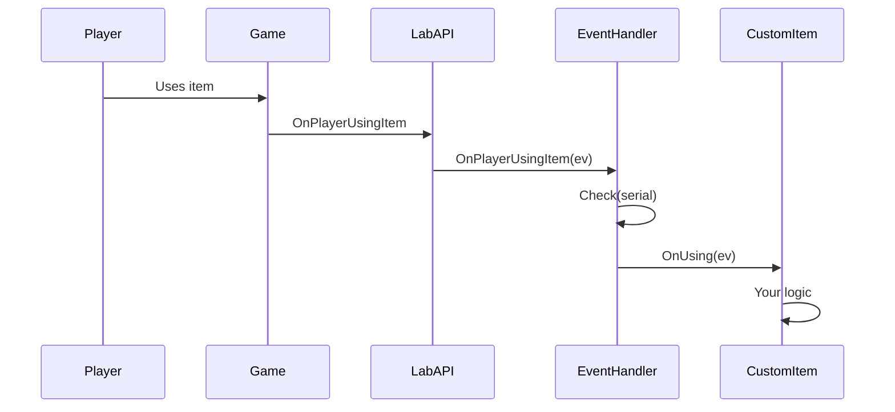

## Overview

The CustomItems framework provides a comprehensive event system that allows you to respond to player interactions with your custom items. Events are automatically routed from LabAPI to your custom item instances based on their serial numbers.

## Event flow

When a player interacts with a custom item:

1. **Game action occurs**: Player performs an action (use, drop, pickup, etc.)
2. **LabAPI captures event**: The event is intercepted by LabAPI
3. **EventHandler checks serial**: `EventHandler.cs` verifies if the item is a custom item
4. **Delegate to instance**: Event is forwarded to the specific `CustomItem` instance
5. **Your code executes**: Your override of the event method runs



## Available event hooks

All event hooks are virtual methods in the `CustomItem` class, meaning they have default (empty) implementations and you only need to override the ones you care about.

### Using events

Fired when a player uses a consumable item.

#### OnUsing

```csharp
public virtual void OnUsing(PlayerUsingItemEventArgs ev) { }
```

Called when a player **begins** using the item (e.g., starts consuming adrenaline).

**Event arguments:**
- `ev.Player` - The player using the item
- `ev.UsableItem` - The item being used
- `ev.IsAllowed` - Set to `false` to cancel the action

**Example - Custom healing with coroutine:**

```csharp HealingSyringe.cs:25-35
public override void OnUsing(PlayerUsingItemEventArgs ev)
{
    const float initialDelay = 1.5f;
    const float duration = 5f;
    const float tickRate = 1f;
    const int healPerTick = 10;

    Timing.RunCoroutine(HealOverTime(ev.Player, initialDelay, duration, tickRate, healPerTick));

    ev.Player.RemoveItem(ev.UsableItem);
}
```

#### OnUsed

```csharp
public virtual void OnUsed(PlayerUsedItemEventArgs ev) { }
```

Called after the player **finishes** using the item.

**Event arguments:**
- `ev.Player` - The player who used the item
- `ev.UsableItem` - The item that was used

<Info>
`OnUsing` is called at the start of use, while `OnUsed` is called after completion. For instant effects, use `OnUsing`. For effects that should occur after the animation, use `OnUsed`.
</Info>

### Dropping events

Fired when a player drops an item from their inventory.

#### OnDropping

```csharp
public virtual void OnDropping(PlayerDroppingItemEventArgs ev) { }
```

Called when a player **begins** dropping the item.

**Event arguments:**
- `ev.Player` - The player dropping the item
- `ev.Item` - The item being dropped (still in inventory)
- `ev.IsAllowed` - Set to `false` to prevent dropping

**Example - Prevent dropping:**

```csharp
public override void OnDropping(PlayerDroppingItemEventArgs ev)
{
    ev.IsAllowed = false;
    ev.Player.SendHint("This item cannot be dropped!");
}
```

#### OnDropped

```csharp
public virtual void OnDropped(PlayerDroppedItemEventArgs ev) { }
```

Called after the item has been **dropped** and is now a pickup in the world.

**Event arguments:**
- `ev.Player` - The player who dropped the item
- `ev.Pickup` - The pickup object now in the world

### Pickup events

Fired when a player picks up an item from the world.

#### OnPickingUp

```csharp
public virtual void OnPickingUp(PlayerPickingUpItemEventArgs ev) { }
```

Called when a player **attempts** to pick up the item.

**Event arguments:**
- `ev.Player` - The player picking up the item
- `ev.Pickup` - The pickup being picked up
- `ev.IsAllowed` - Set to `false` to prevent pickup

**Example - Role restriction:**

```csharp
public override void OnPickingUp(PlayerPickingUpItemEventArgs ev)
{
    if (ev.Player.Role != RoleTypeId.Scientist)
    {
        ev.IsAllowed = false;
        ev.Player.SendHint("Only scientists can use this item!");
    }
}
```

#### OnPickedUp

```csharp
public virtual void OnPickedUp(PlayerPickedUpItemEventArgs ev) { }
```

Called after the player has **successfully picked up** the item.

**Event arguments:**
- `ev.Player` - The player who picked up the item
- `ev.Item` - The item now in their inventory

<Note>
The framework automatically shows a hint when items are picked up (if `ShowItemHints` and `ShowPickupHints` are true). This happens in `EventHandler.cs:65-72`.
</Note>

### Selection events

Fired when a player changes their currently held item.

#### OnSelecting

```csharp
public virtual void OnSelecting(PlayerChangingItemEventArgs ev) { }
```

Called when a player **begins selecting** this item (switching to it).

**Event arguments:**
- `ev.Player` - The player changing items
- `ev.OldItem` - The previously held item (may be null)
- `ev.NewItem` - The item being selected (your custom item)
- `ev.IsAllowed` - Set to `false` to prevent selection

#### OnUnselecting

```csharp
public virtual void OnUnselecting(PlayerChangingItemEventArgs ev) { }
```

Called when a player **begins unselecting** this item (switching away from it).

**Event arguments:**
- `ev.Player` - The player changing items
- `ev.OldItem` - The item being unselected (your custom item)
- `ev.NewItem` - The item being switched to (may be null)
- `ev.IsAllowed` - Set to `false` to prevent unselection

#### OnSelected

```csharp
public virtual void OnSelected(PlayerChangedItemEventArgs ev) { }
```

Called after the player **has selected** this item.

**Event arguments:**
- `ev.Player` - The player who selected the item
- `ev.OldItem` - The previously held item
- `ev.NewItem` - The now-selected item (your custom item)

#### OnUnselected

```csharp
public virtual void OnUnselected(PlayerChangedItemEventArgs ev) { }
```

Called after the player **has unselected** this item.

**Event arguments:**
- `ev.Player` - The player who unselected the item
- `ev.OldItem` - The item that was unselected (your custom item)
- `ev.NewItem` - The newly selected item

<Warning>
Be careful when canceling selection events (`ev.IsAllowed = false`). This can create confusing UX if players can't switch items as expected.
</Warning>

## Event implementation in framework

Here's how the framework routes events to your custom items:

```csharp EventHandler.cs:34-43
public override void OnPlayerUsingItem(PlayerUsingItemEventArgs ev)
{
    if (!Check(ev.UsableItem.Serial)) return;
    API.CustomItems.CurrentItems[ev.UsableItem.Serial].OnUsing(ev);
}
public override void OnPlayerUsedItem(PlayerUsedItemEventArgs ev)
{
    if (!Check(ev.UsableItem.Serial)) return;
    API.CustomItems.CurrentItems[ev.UsableItem.Serial].OnUsed(ev);
}
```

The `EventHandler`:
1. Checks if the serial number exists in `CurrentItems` dictionary
2. Retrieves the specific `CustomItem` instance
3. Calls the corresponding event method on that instance

## Advanced: Subscribing to additional events

You can subscribe to other LabAPI events in `OnRegistered()` for more complex behavior:

```csharp EMPGrenade.cs:10-50
public class EMPGrenade : CustomItem
{
    public override string Name => "EMP Grenade";

    public override string Description => "Locks doors and disables lights in current room.";

    public override ItemType Type => ItemType.GrenadeHE;

    public override void OnRegistered()
    {
        ServerEvents.ProjectileExploding += OnExplosion;
    }

    public override void OnUnregistered()
    {
        ServerEvents.ProjectileExploding -= OnExplosion;
    }

    private void OnExplosion(ProjectileExplodingEventArgs ev)
    {
        if (!Check(ev.TimedGrenade)) return;
        ev.IsAllowed = false;
        Log.Debug($"EMP Grenade exploded at {ev.TimedGrenade.Position} in room {ev.TimedGrenade.Room.Name}.");

        Room room = ev.TimedGrenade.Room;

        room.LightController.FlickerLights(10);

        foreach (var door in room.Doors)
        {
            if (door.IsLocked) continue;
            door.IsLocked = true;

            Timing.CallDelayed(10f, () =>
            {
                door.IsLocked = false;
            });
        }

        NetworkServer.Destroy(ev.TimedGrenade.GameObject);
    }
}
```

This EMP grenade:
1. Subscribes to `ProjectileExploding` event in `OnRegistered()`
2. Uses `Check()` to verify it's this custom item
3. Cancels the normal explosion
4. Implements custom behavior (flicker lights, lock doors)
5. Cleans up the grenade object

## Event patterns

<AccordionGroup>
  <Accordion title="Canceling vs modifying behavior">
    You can prevent actions by setting `ev.IsAllowed = false`:
    
    ```csharp
    public override void OnDropping(PlayerDroppingItemEventArgs ev)
    {
        ev.IsAllowed = false; // Prevents dropping entirely
    }
    ```
    
    Or allow the action but add side effects:
    
    ```csharp
    public override void OnDropped(PlayerDroppedItemEventArgs ev)
    {
        // Item was dropped, but let's modify it
        ev.Pickup.Weight = 2.0f;
    }
    ```
  </Accordion>

  <Accordion title="Instant vs delayed effects">
    For instant effects, use the "before" events:
    
    ```csharp
    public override void OnUsing(PlayerUsingItemEventArgs ev)
    {
        ev.Player.Heal(50); // Instant heal
    }
    ```
    
    For effects after completion, use "after" events:
    
    ```csharp
    public override void OnUsed(PlayerUsedItemEventArgs ev)
    {
        ev.Player.SendHint("Treatment complete!");
    }
    ```
  </Accordion>

  <Accordion title="Using coroutines for ongoing effects">
    Use MEC coroutines for effects over time:
    
    ```csharp
    public override void OnUsing(PlayerUsingItemEventArgs ev)
    {
        Timing.RunCoroutine(BuffPlayer(ev.Player, duration: 10f));
    }
    
    private IEnumerator<float> BuffPlayer(Player player, float duration)
    {
        // Apply buff
        yield return Timing.WaitForSeconds(duration);
        // Remove buff
    }
    ```
  </Accordion>
</AccordionGroup>

## Next steps

- Learn about [custom item properties](/concepts/custom-items) and the base class
- Understand [registration](/concepts/registration) to make your items available
- Review the [architecture](/concepts/architecture) to see how events flow through the system
